# Hướng dẫn sử dụng UrBox Meeting Copilot

- Phiên bản: 3.19.0. Cập nhật: 10/10/2026. Phụ trách: phuc.bh@urbox.vn.
- Ảnh và video trong tài liệu dùng dữ liệu mẫu và tài khoản giả (`*.demo@urbox.vn`), không có dữ liệu thật.
- Dữ liệu tra cứu nội bộ của trợ lý (ticket Jira, danh bạ, kiến trúc hệ thống) hiện là dữ liệu mẫu.

## Mục lục

1. [Video demo](#1-video-demo)
2. [Ứng dụng làm được gì](#2-ứng-dụng-làm-được-gì)
3. [Đăng nhập và khởi động](#3-đăng-nhập-và-khởi-động)
4. [Trang chủ](#4-trang-chủ)
5. [Tạo cuộc họp](#5-tạo-cuộc-họp)
6. [Trong phòng họp](#6-trong-phòng-họp)
7. [Trợ lý AI](#7-trợ-lý-ai)
8. [Sau cuộc họp: biên bản và lưu trữ](#8-sau-cuộc-họp-biên-bản-và-lưu-trữ)
9. [Nhóm cuộc họp](#9-nhóm-cuộc-họp)
10. [Lịch Google và bot Google Meet](#10-lịch-google-và-bot-google-meet)
11. [Chế độ BD](#11-chế-độ-bd)
12. [Hồ sơ giọng nói](#12-hồ-sơ-giọng-nói)
13. [Cài đặt](#13-cài-đặt)
14. [Quyền riêng tư và dữ liệu](#14-quyền-riêng-tư-và-dữ-liệu)
15. [Xử lý sự cố thường gặp](#15-xử-lý-sự-cố-thường-gặp)
16. [Giới hạn cần biết](#16-giới-hạn-cần-biết)

## 1. Video demo

Video: [huong-dan/video-demo.mp4](huong-dan/video-demo.mp4) (4 phút 38 giây, có phụ đề, không có tiếng).

| Thời điểm | Nội dung |
|---|---|
| 0:05 | Đăng nhập bản web |
| 0:13 | Trang chủ, lịch sắp tới |
| 0:28 | Nhóm cuộc họp |
| 0:40 | Tạo cuộc họp |
| 0:49 | Bật mic, chép lời, tách người nói |
| 1:08 | Đặt tên người nói |
| 1:16 | Gọi trợ lý bằng giọng nói |
| 1:25 | Slide, sơ đồ tư duy, dashboard |
| 2:16 | Màn hình trình bày |
| 2:29 | Ghi âm và kết thúc cuộc họp |
| 2:56 | Biên bản, thay đổi so với các buổi trước |
| 3:09 | Cuộc họp Google Meet có bot |
| 3:21 | Chế độ BD: Bảng BD |
| 3:44 | Chế độ BD: hỏi về các cuộc họp |
| 3:57 | Cài đặt |
| 4:25 | Hồ sơ giọng nói |

## 2. Ứng dụng làm được gì

- **Chép lời theo thời gian thực** và **tự tách từng người nói**. Đã lưu mẫu giọng thì tự nhận ra tên.
- **Trợ lý AI** gọi bằng giọng nói hoặc gõ chữ:
  - tóm tắt, trả lời câu hỏi về cuộc họp;
  - soạn slide, dashboard, sơ đồ tư duy, báo cáo nhanh, phác thảo trang web;
  - mở tài liệu trên máy để trình bày, tra cứu trên mạng.
- **Biên bản tự động** khi kết thúc cuộc họp:
  - lưu lên Google Drive của nhóm, hoặc lưu về thư mục trên máy;
  - nhắc những điều nói khác so với các buổi họp trước của nhóm.
- **Nhóm cuộc họp** để gom cuộc họp cùng chủ đề và chia sẻ cho đồng nghiệp.
- **Bot vào Google Meet** theo lịch, chép lời từng người online. Họp nửa online nửa trực tiếp vẫn chép đủ.
- **Chế độ BD**:
  - khi khách hỏi, trợ lý gợi ý câu trả lời từ tài liệu của nhóm và các cuộc họp trước;
  - chủ nhóm hỏi và lấy báo cáo trên toàn bộ cuộc họp của nhóm.

Có hai cách dùng:

| | Bản web | Bản chạy trên máy |
|---|---|---|
| Mở | Địa chỉ web do quản trị viên gửi | Chạy `run.cmd` trên máy Windows đã cài |
| Đăng nhập | Google, chỉ tài khoản @urbox.vn | Không cần |
| Xem cuộc họp | Của mình và của nhóm mình | Mọi cuộc họp trên máy đó |
| Chia sẻ nhóm, Google Drive, bot Google Meet, Gói AI của tôi | Có | Không |
| Đổi khóa dịch vụ, nguồn AI chung | Chỉ quản trị viên | Chỉ từ chính máy đó |

## 3. Đăng nhập và khởi động

### 3.1. Bản web

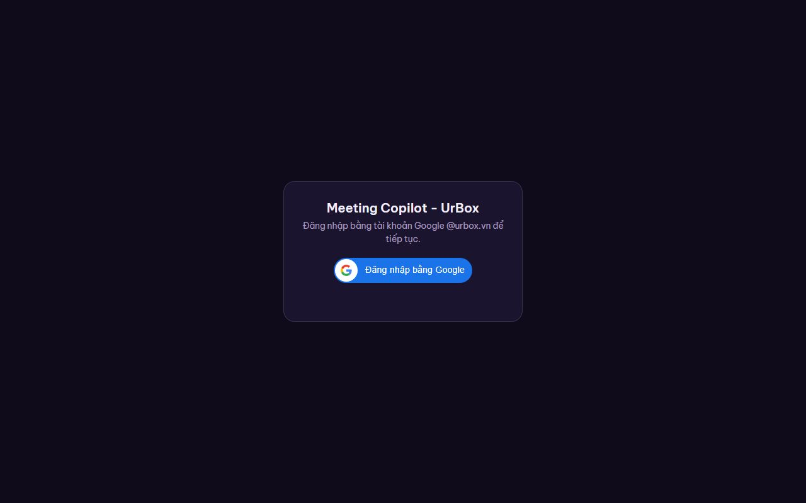

1. Mở địa chỉ web của ứng dụng bằng Chrome hoặc Edge.
2. Bấm **Đăng nhập bằng Google** và chọn tài khoản công ty **@urbox.vn**.
3. Vào thẳng trang **Cuộc họp**.

Lưu ý:
- Tài khoản cá nhân (Gmail) bị từ chối: "Chỉ tài khoản @urbox.vn được dùng ứng dụng này".
- Phiên đăng nhập kéo dài 12 giờ. Hết hạn thì ứng dụng báo "Phiên đăng nhập đã hết hạn, hãy đăng nhập lại.".
- Micro chỉ dùng được trên địa chỉ `https://`.
- **Đăng xuất**: bấm biểu tượng bánh răng ở thanh bên trái (trên điện thoại là thanh dưới). Nút **Đăng xuất**
  nằm ở đầu hộp Cài đặt.
- Quản trị viên thấy dòng "email của bạn - quản trị viên" ở đầu hộp Cài đặt.

### 3.2. Bản chạy trên máy

Máy đã cài sẵn:
1. Bấm đúp `run.cmd` (hoặc gõ `run` trong thư mục dự án).
2. Khoảng 4 giây sau, trình duyệt tự mở `http://127.0.0.1:8080`. Không cần đăng nhập.
3. Lần chạy đầu, ứng dụng tự tải giọng đọc tiếng Việt (khoảng 67 MB).

Nếu cổng 8080 đang bận, ứng dụng hỏi:
- Chọn Y: dừng server cũ rồi chạy lại.
- Chọn N: giữ server cũ, chỉ mở trình duyệt. Sau 20 giây không trả lời thì tự chọn N.

Muốn xem thử với dữ liệu giả: chạy `run.cmd demo`, ứng dụng mở ở `http://127.0.0.1:8090`. Bản này không cần
mic, không cần Atlas.

Máy mới (cần Node.js 20+, pnpm, Python 3.10+ và git):

```bash
pnpm mst-urbox install
pnpm mst-urbox build
pnpm mst-urbox web
```

Thiết lập lần đầu trong **Cài đặt** (biểu tượng bánh răng):
- **Kết nối dịch vụ**: dán Soniox API key. Key này bắt buộc để chép lời. MongoDB Atlas không bắt buộc.
- **Nguồn AI**: chọn API key (Claude, Gemini) hoặc gói đăng ký (Claude.ai, ChatGPT, Gemini).

Không mở cùng một cuộc họp đang diễn ra ở cả bản web và bản trên máy.

## 4. Trang chủ


- **Thanh bên trái**:
  - **Cuộc họp**: trang chủ.
  - **Phòng họp đang mở**: quay lại phòng họp đang mở.
  - **Hồ sơ giọng nói**.
  - **Cài đặt**: biểu tượng bánh răng.
  - **Chấm trạng thái**: bấm để xem "Tình trạng hệ thống" (nhận dạng giọng nói, trợ lý AI, cơ sở dữ liệu...).
- **Cột Nhóm**:
  - "Tất cả cuộc họp", rồi từng nhóm kèm số cuộc họp.
  - Nhóm người khác chia sẻ cho mình có nhãn "được chia sẻ".
  - Nút **+ Tạo nhóm**.
  - Trên điện thoại, cột này là một ô chọn.
- **Lịch sắp tới** (bản web): các buổi họp có link Google Meet trên lịch của bạn.
  Xem [mục 10](#10-lịch-google-và-bot-google-meet).
- **Đang diễn ra**: các cuộc họp chưa kết thúc, hiện trên đầu danh sách.
- **Bộ lọc và tìm kiếm**:
  - Lọc theo "Tất cả" / "Đang diễn ra" / "Đã kết thúc".
  - Ô "Tìm theo tên cuộc họp" tìm theo tên hoặc loại cuộc họp.
- **Danh sách cuộc họp**:
  - Các cột: thời lượng, số người nói, số câu, trạng thái.
  - Menu **...** trên mỗi dòng: "Mở cuộc họp", "Chuyển vào nhóm...", "Xuất Markdown", "Xóa cuộc họp".
- **Đang ghi ở cuộc họp khác**: thanh trên hiện nhãn "Đang ghi: (tên cuộc họp)", bấm vào để quay lại cuộc họp
  đó.

## 5. Tạo cuộc họp

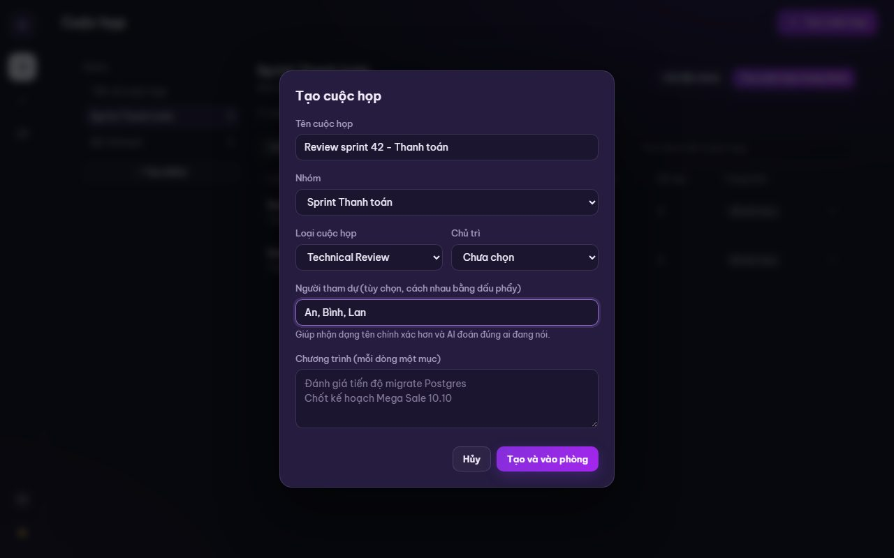

Bấm **Tạo cuộc họp** ở góc trên bên phải. Đang xem một nhóm thì bấm **Tạo cuộc họp trong nhóm**.

| Ô | Ghi chú |
|---|---|
| Tên cuộc họp | Bắt buộc, ví dụ "Review Sprint 39 - Payment" |
| Nhóm | Chỉ hiện khi đã có nhóm; mặc định là nhóm đang xem |
| Loại cuộc họp | Technical Review, Sprint Planning, Daily Standup, Brainstorming, Họp khách hàng, Phỏng vấn |
| Chủ trì | Chọn từ hồ sơ giọng nói (không bắt buộc) |
| Người tham dự | Tên cách nhau bằng dấu phẩy: giúp nhận dạng tên chính xác hơn và AI đoán đúng ai đang nói |
| Chương trình | Mỗi dòng một mục |

Bấm **Tạo và vào phòng**, rồi bấm **Bật mic** để bắt đầu ghi. Cuộc họp trên lịch Google có thể được bot tạo tự
động (xem [mục 10](#10-lịch-google-và-bot-google-meet)).

## 6. Trong phòng họp

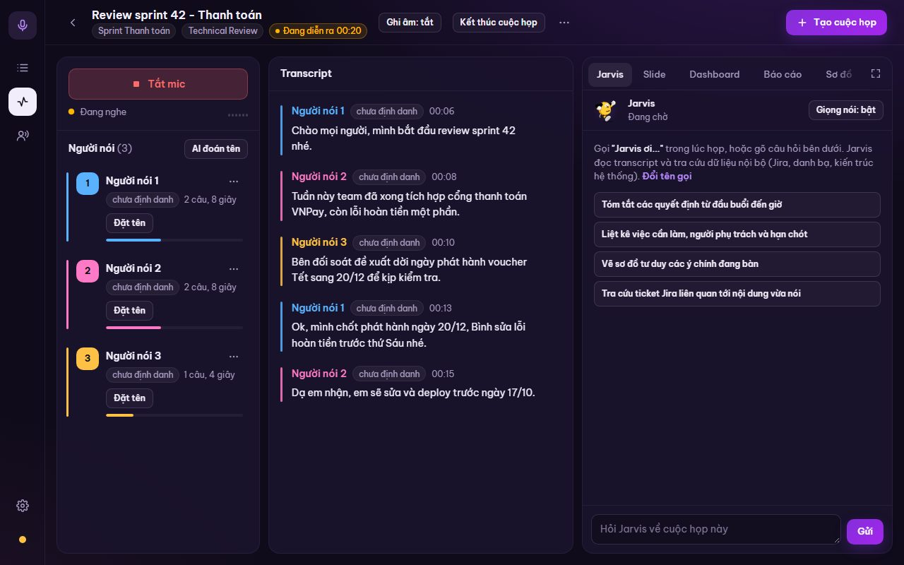

Phòng họp có ba cột:
- **Bên trái**: mic và danh sách người nói.
- **Ở giữa**: lời nói (Transcript).
- **Bên phải**: trợ lý và các sản phẩm AI.

Trên điện thoại, chuyển giữa ba khu vực bằng các nút "Người nói" / "Transcript" / "Jarvis".

### 6.1. Bật mic và chép lời

1. Bấm **Bật mic**, rồi chọn **Cho phép** khi trình duyệt hỏi quyền micro.
2. Khi thấy "Đang nghe", lời nói hiện ra theo thời gian thực. Mỗi người nói một màu.
3. Bấm **Tắt mic** để dừng. Cuộc họp vẫn mở, bật lại lúc nào cũng được.

Lưu ý:
- Mỗi cuộc họp chỉ có một nguồn mic. Thiết bị bật mic sau sẽ tiếp quản ("Một thiết bị khác vừa bật mic cho
  cuộc họp này.").
- Mọi người nên nói gần thiết bị đang bật mic.
- Mất mạng thì ứng dụng tự nối lại và không mất chữ.

### 6.2. Người nói

- Hệ thống tự tách người nói thành "Người nói 1", "Người nói 2"...
- Người đã có mẫu giọng thì tự hiện đúng tên, kèm nhãn "nhận ra giọng".
- **Đặt tên**: bấm vào tên hoặc nút **Đặt tên**.
  - Gõ họ tên, hoặc chọn nhanh từ hồ sơ giọng nói.
  - Có thể ghi thêm chức danh, email.
  - Tick **Lưu mẫu giọng để tự nhận ra ở các buổi họp sau** chỉ khi người đó đồng ý.
  - Đặt trùng tên với một người nói khác thì hai người được gộp làm một.

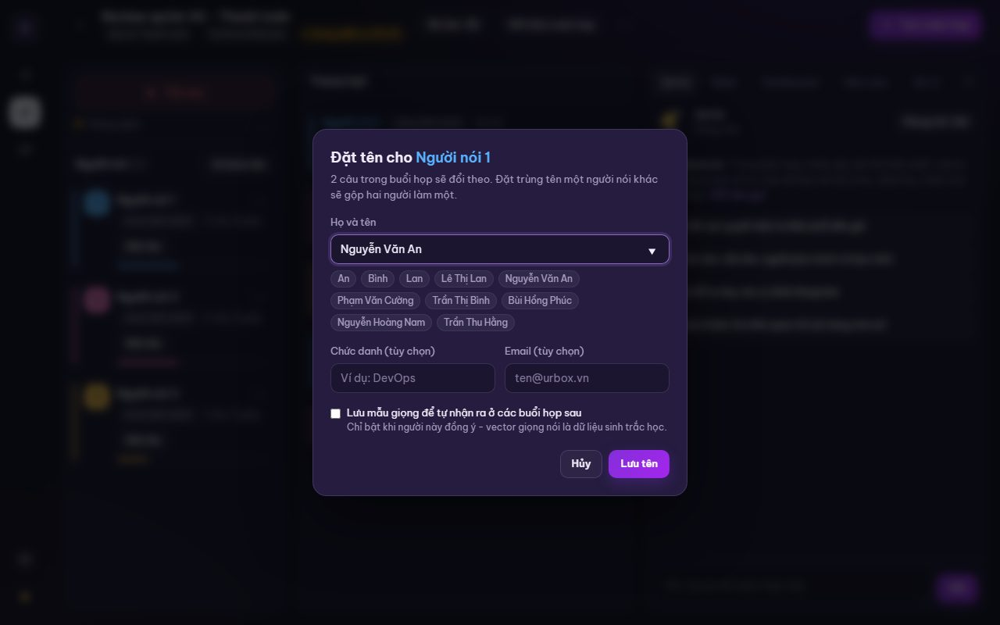

- **Menu ... của người nói**:
  - "Đổi tên".
  - "Lưu mẫu giọng".
  - "Gộp vào người nói khác (cùng một người)".
- **AI đoán tên**: AI đọc hội thoại khi có người tự giới thiệu hoặc được gọi tên.
  - Đoán chắc từ 70% thì tự đặt tên, báo "AI nhận ra X là Y (NN%)".
  - Đoán thấp hơn thì hiện thẻ gợi ý với nút **Xác nhận** / **Bỏ qua**.
  - Bấm nút **AI đoán tên** để chạy ngay.
- Hệ thống tự gộp hoặc tách người nói khi giọng trùng hoặc khác rõ. Mỗi lần như vậy đều có thông báo, và sửa
  tay lại được.

### 6.3. Sửa lời nói

Bấm vào tên người nói ở đầu một đoạn lời nói để mở menu:
- "Câu này là của": chọn đúng người nói cho câu đó.
- "Một người nói mới".
- "Từ câu này trở đi là người khác".
- "Sao chép câu".

Menu cuộc họp (**...** ở thanh trên) có thêm **Phân tích lại người nói**: tách lại người nói cho cả buổi.

### 6.4. Ghi âm

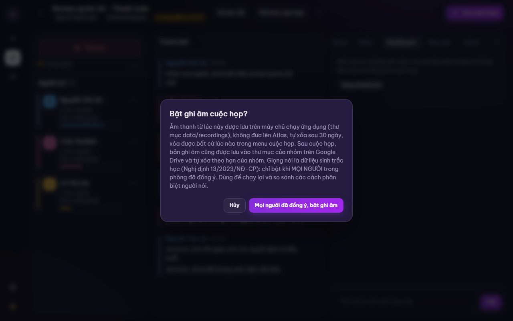

- Ghi âm mặc định **tắt**.
- Bấm **Ghi âm: tắt** để bật. Chỉ bấm **Mọi người đã đồng ý, bật ghi âm** khi **mọi người** trong phòng đã
  đồng ý. Giọng nói là dữ liệu sinh trắc học theo Nghị định 13/2023/NĐ-CP.
- Ứng dụng lưu lại người xác nhận và thời điểm xác nhận.
- Bản ghi âm:
  - tự xóa sau số ngày quy định (mặc định 30);
  - bản web còn lưu một bản vào thư mục của nhóm trên Google Drive;
  - xóa được bất cứ lúc nào bằng **Xóa bản ghi âm** trong menu cuộc họp.

## 7. Trợ lý AI

### 7.1. Cách gọi trợ lý

Tên mặc định là **Jarvis**. Quản trị viên đổi được tên trong Cài đặt.

| Cách gọi | Ví dụ |
|---|---|
| Gọi tên kèm yêu cầu | "Jarvis ơi, tóm tắt giúp anh các quyết định" |
| Gọi tên rồi ngừng | "Jarvis ơi..." rồi nói yêu cầu trong vòng 8 giây |
| Câu gọi chung | "trợ lý ơi", "bot ơi", "hey assistant", "@ai" |
| Gõ chữ | Gõ vào ô "Hỏi Jarvis về cuộc họp này" (Enter để gửi, Shift+Enter xuống dòng); không cần gọi tên |

- Tên chỉ được nhắc tới giữa câu thì không đánh thức trợ lý.
- Trợ lý đáp ngay, vừa làm vừa báo. Việc lâu hơn 20 giây thì trợ lý nói "Sắp xong rồi ạ".
- Muốn hủy: nói "đừng soạn nữa", "không cần tìm nữa".

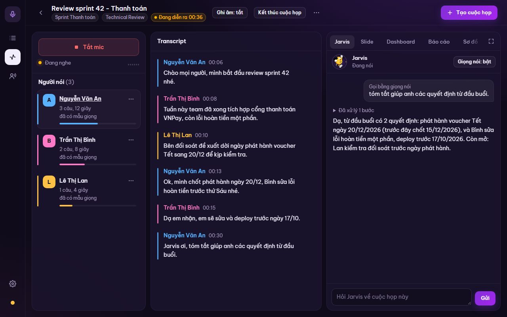

### 7.2. Câu lệnh mẫu

| Việc | Câu nói hoặc gõ |
|---|---|
| Tóm tắt, hỏi đáp | "Tóm tắt các quyết định từ đầu buổi", "Liệt kê việc cần làm, người phụ trách và hạn chót" |
| Biên bản | "Jarvis ơi, lập biên bản" |
| Báo cáo nhanh | "Tổng hợp nhanh cuộc họp" |
| Slide | "Làm slide báo cáo tiến độ sprint"; sửa: "Sửa slide này thêm số liệu doanh thu" |
| Dashboard | "Vẽ dashboard tiến độ sprint"; sửa: "Đổi biểu đồ cột thành đường" |
| Sơ đồ tư duy | "Vẽ sơ đồ tư duy các ý chính" (flowchart, sequence, ERD, Gantt khi nói rõ) |
| Trang web | "Tạo trang web giới thiệu chương trình" |
| Tra cứu trên mạng | "Tra cứu trên mạng tỷ giá USD hôm nay" |
| Mở tài liệu | "Mở file kế hoạch Q4 trong Downloads", "Chiếu file pdf báo cáo tháng 9" |
| Trình bày | "Thuyết trình giúp anh", "Thuyết trình từ slide 3", "Trình bày dashboard giúp anh" |
| Điều khiển slide | "Slide tiếp theo", "Quay lại slide trước", "Mở slide số 3", "Nhắc bài" |
| Xem lại nội dung cũ | "Cho anh xem lại cái dashboard vừa rồi", "Quay lại bộ slide em vừa trình bày" |
| Giải thích sơ đồ | Bấm vào một ý, hoặc "Giải thích nhánh nạp voucher" |
| Nhận xét | "Nhận xét nhanh về cuộc họp" |

### 7.3. Các thẻ sản phẩm AI

Cột phải có các thẻ **Jarvis**, **Slide**, **Dashboard**, **Báo cáo**, **Sơ đồ**, **Giao diện**. Con số trên
thẻ là số sản phẩm.

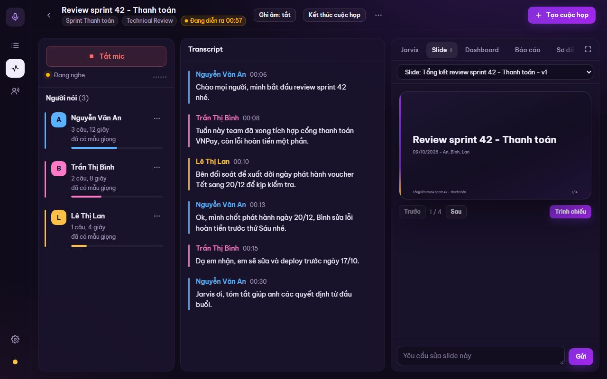

- **Slide**: nút "Trước" / "Sau", **Trình chiếu**, ghi chú cho người trình bày.
- **Dashboard**:
  - KPI và biểu đồ (cột, đường, vùng, tròn, bảng).
  - Nút "Xem bảng" / "Xem biểu đồ".
  - Nhãn "Số liệu minh họa" khi trợ lý thiếu số liệu thật.

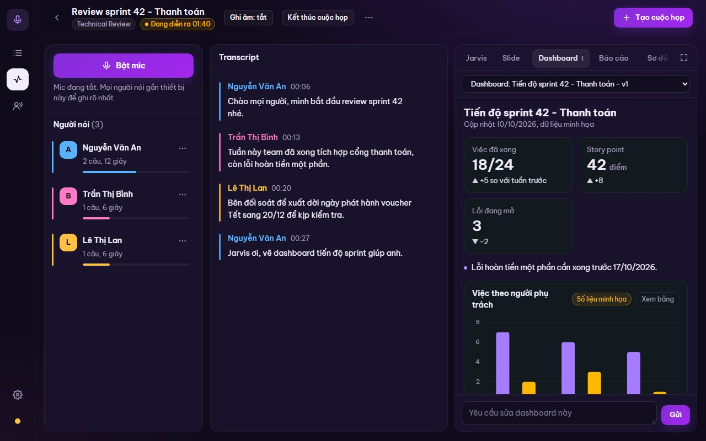

- **Báo cáo**: biên bản và các báo cáo nhanh. Nút **Lập biên bản ngay** khi chưa có biên bản.
- **Sơ đồ**: sơ đồ tư duy kiểu NotebookLM.
  - Bấm vào một ý để trợ lý giải thích. Bấm vòng tròn để mở hoặc thu nhánh.
  - Kéo để di chuyển. Có các nút phóng to, thu nhỏ, vừa khung.

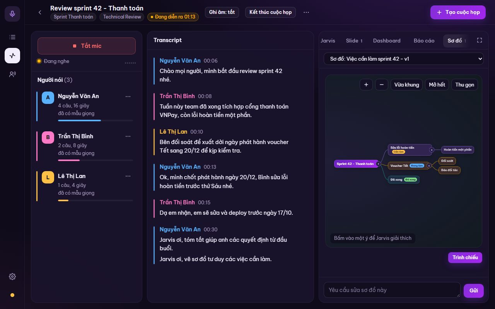

- **Giao diện**: phác thảo trang web, xem dạng máy tính hoặc điện thoại, mở trong cửa sổ riêng.
- **Sửa một sản phẩm**: ở thẻ đó, ô nhập đổi thành "Yêu cầu sửa ... này". Mỗi lần sửa tạo một phiên bản mới.
  Chọn phiên bản cũ ở ô chọn phía trên.

### 7.4. Màn hình trình bày

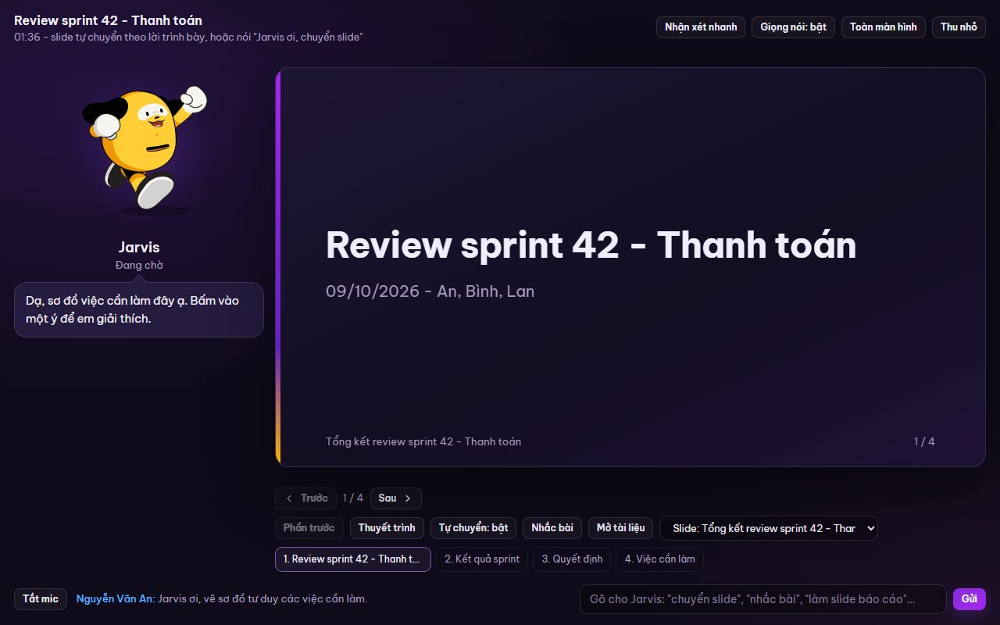

- **Mở**:
  - bấm biểu tượng "Trình chiếu toàn màn hình cùng trợ lý" ở góc thẻ trợ lý;
  - hoặc nói "mở màn hình trình bày".
  - Slide, dashboard, sơ đồ vừa soạn cũng tự mở trên màn hình này.
- **Chiếu cho cả phòng**: kéo cửa sổ sang màn hình chung rồi bấm **Toàn màn hình**.
- **Các nút điều khiển**:
  - "Trước" / "Sau", "Phần trước" (quay lại nội dung trước).
  - **Thuyết trình**: trợ lý tự đọc lời trình bày.
  - **Tự chuyển: bật/tắt**: slide tự chuyển theo lời người đang trình bày.
  - **Nhắc bài**: hiện các ý chính của slide.
  - **Mở tài liệu**, **Nhận xét nhanh**.
- **Phím tắt**:

| Phím | Tác dụng |
|---|---|
| Mũi tên trái / phải, PageUp / PageDown | Chuyển slide |
| N | Nhắc bài |
| V | Bật / tắt giọng nói của trợ lý |
| F | Toàn màn hình |
| Esc | Dừng thuyết trình hoặc thu nhỏ màn hình trình bày |

**Mở tài liệu để trình bày**:
- Trợ lý tìm tệp PDF, PowerPoint, Word, Markdown trong **Thư mục tài liệu** (xem [mục 13](#13-cài-đặt)).
- Trước khi trình bày, trợ lý hỏi cách trình bày:
  - **Em tự trình bày**;
  - **Theo ghi chú trong tệp**;
  - **Chọn tệp kịch bản**;
  - **Dán kịch bản**;
  - **Để tôi trình bày**.
- PowerPoint nên lưu thêm bản PDF để hiện đúng thiết kế.

### 7.5. Giọng nói và hình đại diện

- Nút **Giọng nói: bật / tắt** (hoặc phím V): tắt thì trợ lý chỉ hiện phụ đề, không nói thành tiếng.
- Hình đại diện có 3 kiểu: "Linh vật UrBox", "Hộp quà", "Khuôn mặt tròn". Chọn trong Cài đặt.
- Lựa chọn giọng nói và hình đại diện được nhớ theo từng trình duyệt.

## 8. Sau cuộc họp: biên bản và lưu trữ

### 8.1. Kết thúc cuộc họp và biên bản tự động

1. Bấm **Kết thúc cuộc họp**, rồi xác nhận. Mic tắt.
2. AI lập biên bản. Biên bản hiện ở thẻ **Báo cáo**, gồm:
   - tóm tắt;
   - quyết định;
   - bảng phân công (việc, người phụ trách, hạn chót);
   - rủi ro.
3. Sau khi kết thúc vẫn đặt tên, gộp người nói và sửa từng câu được.

Lập lại biên bản: bấm **Lập biên bản ngay** ở thẻ Báo cáo, hoặc nói "Jarvis ơi, lập biên bản".

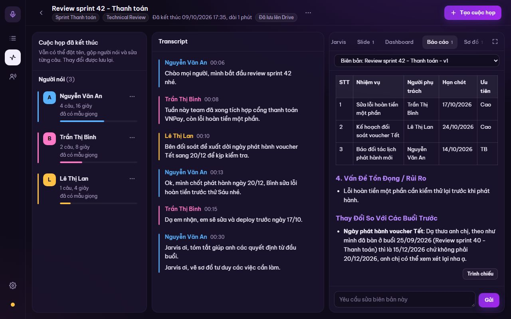

**Thay đổi so với các buổi trước** (chỉ cuộc họp thuộc nhóm):
- AI so điều vừa chốt với điều nhóm đã chốt ở tối đa 12 buổi trước: quyết định, con số, hạn chót, người phụ
  trách, chính sách.
- Có điểm nói khác thì biên bản có thêm mục này, ví dụ:
  > Dạ thưa anh chị, theo như mình đã bàn ở buổi 25/09/2026 (Review sprint 40) thì là 15/12/2026 chứ không
  > phải 20/12/2026, anh chị có thể xem xét lại nha ạ.
- Trợ lý chỉ ghi vào biên bản, không nhắc hay ngắt lời trong lúc họp.

### 8.2. Tải về, lưu Drive, lưu về máy

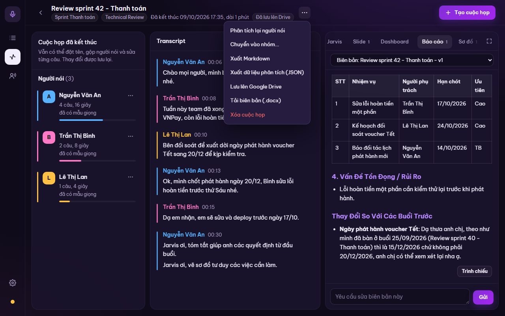

Mọi thao tác dưới đây nằm trong menu cuộc họp (**...** ở thanh trên):

| Mục trong menu | Tác dụng |
|---|---|
| Tải biên bản (.docx) | Tải biên bản dạng Word |
| Tải ghi âm (.mp3) | Tải ghi âm (nếu có bật ghi âm) |
| Lưu lên Google Drive | Lưu (lại) biên bản và ghi âm lên Drive của nhóm (bản web) |
| Chuyển vào nhóm... | Đưa cuộc họp vào nhóm khác hoặc gỡ khỏi nhóm |
| Xuất Markdown | Tải nội dung cuộc họp dạng Markdown |
| Xuất dữ liệu phân tích (JSON) | Dữ liệu chi tiết (kèm vector giọng) |
| Xóa bản ghi âm | Xóa ghi âm, giữ lời nói và người nói |
| Xóa cuộc họp | Xóa vĩnh viễn cuộc họp, lời nói, người nói, biên bản |

**Google Drive** (bản web):
- Biên bản tự lưu vào Drive của **chủ nhóm**, theo đường dẫn:
  `Meeting Copilot / <Tên nhóm> / <dd-mm-yyyy HHhMM - Tiêu đề> /`.
  - Biên bản lưu dạng Google Docs, kèm `Ghi âm.mp3` nếu có ghi âm.
  - Cuộc họp không thuộc nhóm lưu vào `Cuộc họp riêng` trong Drive của người tạo.
- Thanh trên của phòng họp cho biết trạng thái lưu:
  - "Đã lưu lên Drive" (bấm để mở thư mục);
  - "Đang lưu lên Drive";
  - "Chưa lưu Drive: cần kết nối";
  - "Lưu Drive lỗi - Lưu lại".
- Thành viên nhóm được chia sẻ quyền chỉnh sửa thư mục của nhóm.

**Lưu về thư mục trên máy** (chỉ Chrome, Edge):
- Chọn thư mục gốc trong Cài đặt, mục **Lưu biên bản về máy**.
- Ứng dụng tự ghi `<gốc>/<Tên nhóm>/<dd-mm-yyyy HHhMM - Tiêu đề>/Biên bản.docx` (kèm `Ghi âm.mp3`).
- Biên bản xong lúc đang đóng ứng dụng thì được ghi bù ở lần mở sau.
- Khi trình duyệt cần cấp lại quyền ghi, trang chủ hiện nút **Cho phép lưu**.

## 9. Nhóm cuộc họp

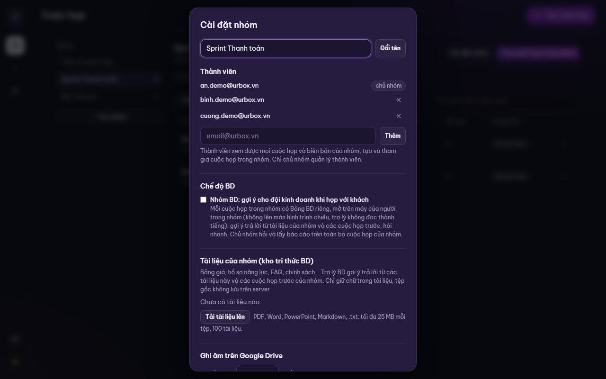

- **Tạo nhóm**: bấm **+ Tạo nhóm** ở cột Nhóm, nhập tên nhóm.
- **Vai trò**:

| Vai trò | Quyền |
|---|---|
| Chủ nhóm | Đổi tên nhóm, thêm / bớt thành viên (email @urbox.vn, tối đa 100), cài đặt nhóm, gỡ cuộc họp khỏi nhóm, xóa nhóm |
| Thành viên | Xem mọi cuộc họp và biên bản của nhóm, tạo và tham gia cuộc họp trong nhóm |
| Người ngoài nhóm | Không xem được: mở link nhận "không tìm thấy" |

- **Cài đặt nhóm** (chủ nhóm, nút ở đầu trang nhóm):
  - "Đổi tên", "Thành viên".
  - "Chế độ BD", "Tài liệu của nhóm (kho tri thức BD)".
  - "Ghi âm trên Google Drive" (tự xóa sau số ngày), "Thư mục trên Google Drive".
  - "Thư mục trên máy cho nhóm này" (lưu biên bản của nhóm vào thư mục riêng).
  - "Xóa nhóm": cuộc họp vẫn còn, chỉ không thuộc nhóm nào nữa.
- **Chuyển cuộc họp vào nhóm**: menu cuộc họp, chọn **Chuyển vào nhóm...**. Chọn "Không thuộc nhóm" để gỡ khỏi
  nhóm.

## 10. Lịch Google và bot Google Meet

Phần này chỉ có ở bản web.

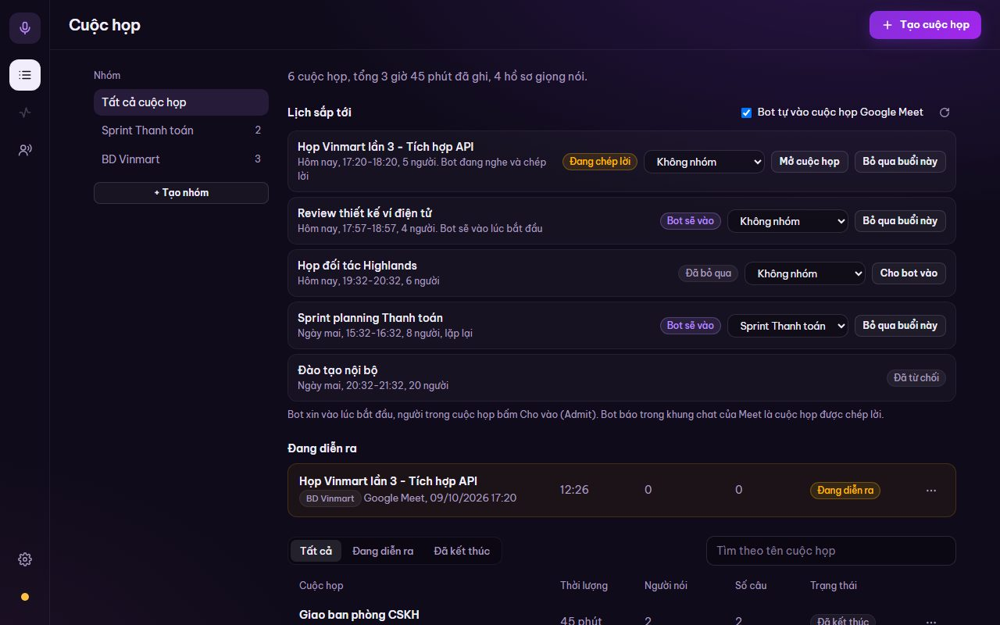

### 10.1. Bật bot

1. Mở Cài đặt, mục **Google (Drive và Lịch)**.
2. Bấm **Kết nối Google** và cho phép cả hai quyền Drive và Lịch.
   - Đã kết nối Drive từ trước thì bấm **Kết nối lại** để thêm quyền Lịch.
   - Lịch chỉ được đọc, không sửa.
3. Tick **Tự cho bot vào các cuộc họp có link Google Meet trên lịch của tôi**. Ở trang chủ, công tắc này mang
   tên "Bot tự vào cuộc họp Google Meet".
4. Từ đó bot "Trợ lý họp UrBox" tự vào mọi buổi họp có link Meet trên lịch của bạn. Tắt công tắc thì các buổi
   sau bot không vào nữa.

### 10.2. Lịch sắp tới

Mỗi buổi trong 7 ngày tới hiện:
- giờ, số người;
- trạng thái bot: "Bot sẽ vào", "Chờ cho bot vào", "Đang chép lời", "Đã xong", "Bot không vào được" (kèm lý
  do), "Đã bỏ qua", "Đã từ chối", "Không có link Meet";
- các nút:
  - **Bỏ qua buổi này** / **Cho bot vào**: bot đã vào mà bấm Bỏ qua thì bot rời ngay;
  - **Mời bot vào lại**: dùng khi lần trước chưa ai cho bot vào;
  - **Mở cuộc họp**;
  - ô chọn **nhóm** cho cuộc họp sẽ tạo. Buổi họp lặp lại thì áp dụng cho cả chuỗi.

### 10.3. Khi bot vào họp

- Bot vào Meet với tư cách **khách**: người trong cuộc họp phải bấm **Cho vào** (Meet chỉ chờ 10 phút).
- Bot nhắn trong khung chat của Meet rằng cuộc họp được chép lời. Với khách ngoài công ty, nên báo trước khi
  họp.
- Cuộc họp đặt chế độ chỉ cho người trong tổ chức vào thì bot bị chặn. Lịch sắp tới báo rõ lý do.
- Cuộc họp trong ứng dụng được tạo tự động:
  - tiêu đề, người tham dự, chương trình lấy từ lịch;
  - nhóm lấy theo lựa chọn của bạn;
  - mỗi người trong Meet có một luồng chép lời riêng, đúng tên trong Meet.
- Kết thúc:
  - mọi người rời Meet thì bot tự rời, cuộc họp kết thúc và biên bản được lập;
  - bấm **Kết thúc cuộc họp** trong ứng dụng thì bot cũng rời Meet.

### 10.4. Họp nửa online nửa trực tiếp

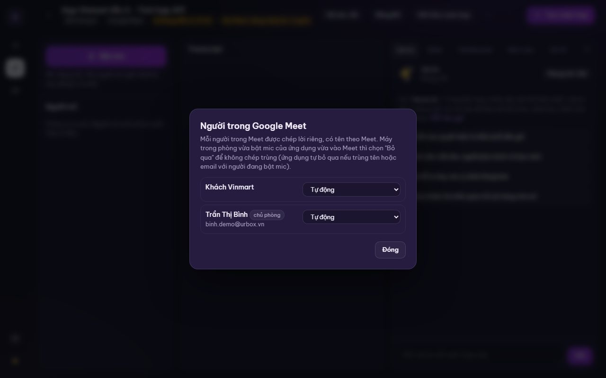

- Một người trong phòng bật mic trên ứng dụng như bình thường. Người online được chép lời qua bot.
- Máy trong phòng mà cũng vào Meet:
  - Luồng Meet của máy đó tự bị bỏ qua nếu trùng tên hoặc email với người đang bật mic.
  - Không trùng thì mở menu cuộc họp, chọn **Người trong Google Meet...**, rồi chọn **Bỏ qua (máy trong
    phòng)**.
  - Các lựa chọn khác: **Tự động**, **Luôn chép**.
- Phòng họp nên dùng loa có khử tiếng vọng hoặc tai nghe. Ứng dụng cũng tự bỏ các câu mic thu lại từ loa phát
  tiếng người online.

## 11. Chế độ BD

Chế độ BD dành cho nhóm kinh doanh họp với khách.

### 11.1. Bật chế độ BD

1. Chủ nhóm mở **Cài đặt nhóm** và tick **Nhóm BD**. Đầu trang nhóm hiện nhãn "Nhóm BD".
2. Mục **Tài liệu của nhóm**: bấm **Tải tài liệu lên** để thêm bảng giá, hồ sơ năng lực, FAQ, chính sách.
   - Nhận PDF, Word, PowerPoint, Markdown, .txt; tối đa 25 MB mỗi tệp, 100 tài liệu.
   - Server chỉ giữ chữ trong tài liệu, không giữ tệp gốc.
   - Thành viên xem được danh sách tài liệu.

### 11.2. Bảng BD trong cuộc họp với khách

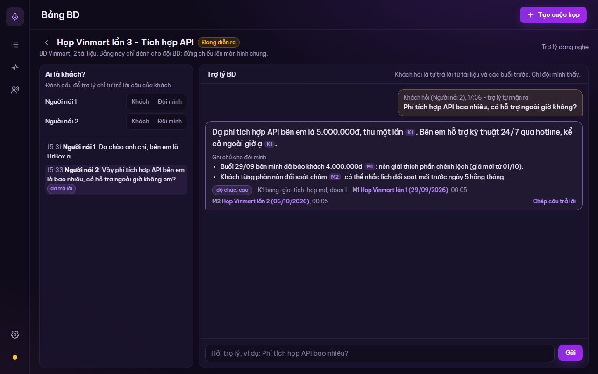

1. Trong phòng họp, bấm **Bảng BD**. Bảng mở ở tab mới.
2. Mở tab đó trên máy của người trong đội. **Không chiếu lên màn hình chung.** Trợ lý không đọc nội dung bảng
   thành tiếng.
3. Ở cột "Ai là khách?", đánh dấu từng người là **Khách** hoặc **Đội mình**. Trợ lý chỉ tự trả lời câu của
   khách.

Khung chat **Trợ lý BD**:
- **Khách hỏi**: trợ lý tự nhận ra câu hỏi. Câu hỏi hiện ngay, câu trả lời tới sau vài giây. Lời chào và câu
  xác nhận được bỏ qua.
- **Đội BD gõ hỏi** vào ô "Hỏi trợ lý". Câu hỏi nối tiếp được hiểu theo các lượt trước.
- **Câu trợ lý bỏ sót**: bấm **Hỏi AI** ngay ở câu đó trong phần lời nói bên trái.
- Mỗi câu trả lời gộp hai nguồn, kèm dấu nguồn ngay sau từng ý:
  - **K**: tài liệu của nhóm. Rê chuột vào để xem tên tài liệu và đoạn.
  - **M**: cuộc họp trước. Bấm để mở cuộc họp đó.
- **Ghi chú cho đội mình**: điều đã nói, hứa, báo giá ở buổi trước; chỗ khác với tài liệu; điều nên hỏi thêm
  khách.
- Mỗi câu trả lời còn có **độ chắc** (cao / vừa / thấp) và nút **Chép câu trả lời** (chép không kèm dấu
  nguồn).
- Câu đã được trả lời có dấu "đã trả lời" ở phần lời nói. Bấm vào dấu đó để xem câu trả lời.
- **Tra thêm trên mạng**: câu trả lời tự động chỉ lấy từ tài liệu của nhóm và các cuộc họp trước. Cần thông
  tin bên ngoài (tỷ giá, tin tức, đối thủ) thì bấm **Tra thêm trên mạng** dưới câu trả lời.
  - Trợ lý tra internet cho câu hỏi đó, khoảng 15-30 giây. Mỗi lần bấm có tính phí, nên chỉ bấm khi cần.
  - Kết quả hiện trong khối **Trên mạng** (viền vàng), có dấu nguồn **W**. Bấm W1, W2 để mở trang web đó.
  - Đây là thông tin công khai, chưa kiểm chứng: kiểm tra lại trước khi nói với khách. Giá, chính sách của
    UrBox vẫn theo tài liệu của nhóm.
  - Tra lỗi thì bấm **Tra lại**.

### 11.3. Chủ nhóm hỏi về các cuộc họp

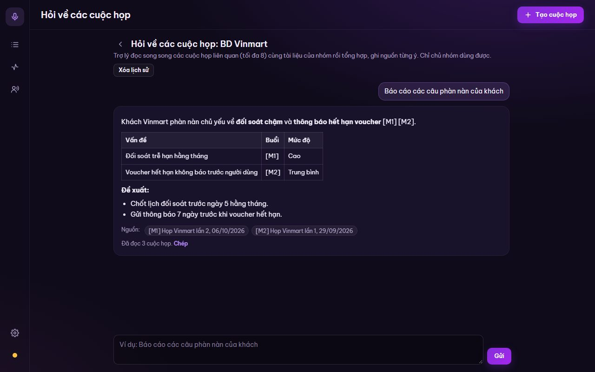

- Chủ nhóm BD bấm **Hỏi về các cuộc họp** ở đầu trang nhóm.
- Ví dụ câu hỏi:
  - "Báo cáo các câu phàn nàn của khách";
  - "Khách đang gặp vấn đề gì?";
  - "Mình đã hứa hoặc cam kết gì với khách?";
  - "Tổng hợp các yêu cầu khách đưa ra".
- Trợ lý đọc song song tối đa 8 cuộc họp liên quan cùng tài liệu của nhóm, rồi tổng hợp thành câu trả lời hoặc
  báo cáo (có bảng, đề xuất).
  - Mỗi ý ghi nguồn [M1], [K1]. Bấm nguồn để mở cuộc họp đó.
  - Trong lúc chạy, trang hiện "Đang đọc 3/8 cuộc họp...".
- Lịch sử giữ 50 tin gần nhất. Bấm **Xóa lịch sử** để xóa.

## 12. Hồ sơ giọng nói

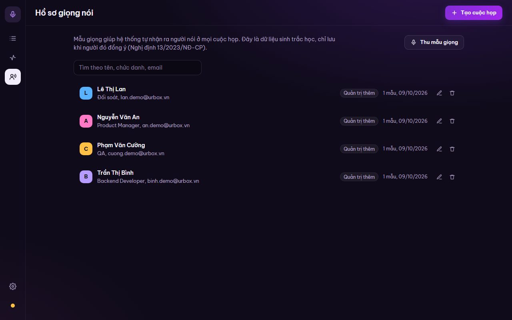

- Mẫu giọng giúp hệ thống tự nhận ra người nói ở mọi cuộc họp. Hồ sơ dùng chung cả công ty.
- **Thu mẫu giọng**:
  1. Bấm **Thu mẫu giọng**, nhập họ tên, chức danh, phòng ban, email.
  2. Tick "Người được thu đã đồng ý lưu dữ liệu giọng nói.".
  3. Bấm **Bắt đầu thu**. Người được thu đọc to đoạn mẫu khoảng 10 giây (ít nhất 5 giây).
- Cách khác để lưu mẫu giọng: khi đặt tên người nói trong cuộc họp, tick **Lưu mẫu giọng** (cần người đó đồng
  ý).
- Mỗi hồ sơ có nút **Sửa thông tin** và **Xóa hồ sơ**. Xóa hồ sơ thì các cuộc họp sau không tự nhận ra người
  đó nữa. Tên trong các cuộc họp cũ vẫn giữ nguyên.
- Trên bản web, mọi người dùng đều sửa và xóa được hồ sơ. Chỉ sửa hồ sơ khi có lý do.

## 13. Cài đặt

Mở bằng biểu tượng bánh răng ở thanh bên trái.

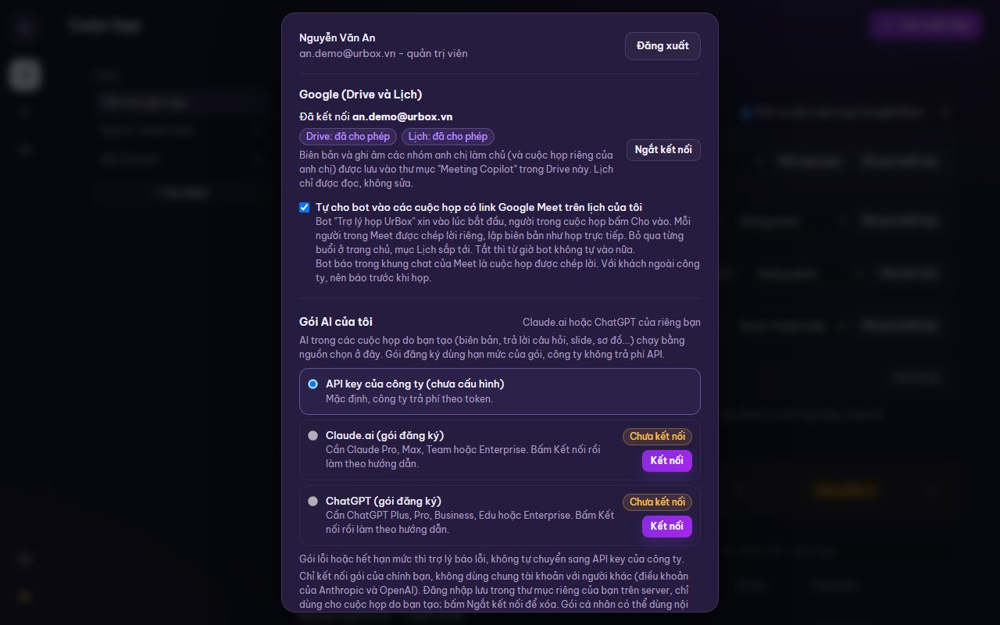

Các mục, theo thứ tự trong hộp Cài đặt:

| # | Mục | Dùng để | Ai đổi được (bản web) |
|---|---|---|---|
| 1 | Tài khoản | Tên, email, nút Đăng xuất | Mỗi người |
| 2 | Google (Drive và Lịch) | Kết nối Google, trạng thái quyền Drive / Lịch, công tắc bot vào Google Meet | Mỗi người, cho chính mình |
| 3 | Gói AI của tôi | Chạy AI cho cuộc họp của mình bằng gói Claude.ai / ChatGPT của chính mình | Mỗi người, cho chính mình |
| 4 | Cài đặt trợ lý | Tên gọi trợ lý và các tên gọi khác (tên bị nhận dạng sai) | Chỉ quản trị viên (dùng chung toàn hệ thống) |
| 5 | Hình đại diện trợ lý | Linh vật UrBox, Hộp quà, Khuôn mặt tròn | Mỗi người (nhớ theo trình duyệt) |
| 6 | Giọng đọc của trợ lý | Soniox (tự nhiên) hoặc Trên máy (Piper); chọn giọng; Nghe thử | Đổi: chỉ quản trị viên. Nghe thử: mọi người |
| 7 | Kết nối dịch vụ | Khóa Soniox, MongoDB Atlas | Chỉ quản trị viên |
| 8 | Nguồn AI dùng chung | API key Claude / Gemini, chọn model, dùng API khi gói đăng ký lỗi | Chỉ quản trị viên |
| 9 | Lưu biên bản về máy | Thư mục gốc để tự lưu biên bản và ghi âm (Chrome, Edge) | Mỗi người (nhớ theo trình duyệt) |
| 10 | Thư mục tài liệu | Thư mục trên máy để trợ lý tìm và mở tài liệu | Mỗi người (nhớ theo trình duyệt) |
| 11 | Lưu trữ dữ liệu | Trạng thái lưu (Atlas hay trên máy), đồng bộ lên Atlas | Đồng bộ: chỉ quản trị viên |
| 12 | Sử dụng AI | Số lần gọi AI, token, chi phí ước tính | Chỉ xem |

Người dùng thường vẫn thấy các mục chỉ dành cho quản trị viên, nhưng bấm lưu sẽ bị báo không có quyền. Cần đổi
thì nhờ quản trị viên.

### 13.1. Gói AI của tôi (bản web)

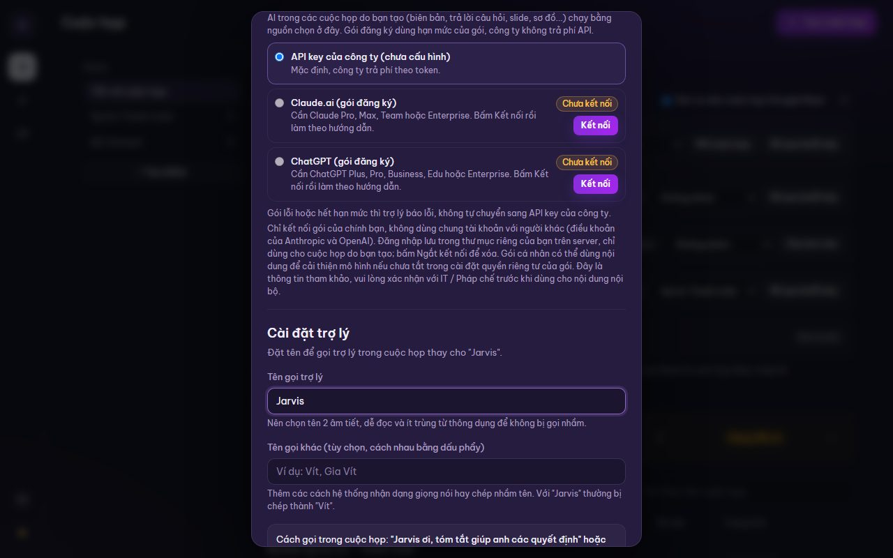

- Mặc định: **API key của công ty**, công ty trả phí theo token.
- **Claude.ai (gói đăng ký)**:
  1. Bấm **Kết nối**, mở trang đăng nhập.
  2. Đăng nhập rồi bấm Authorize.
  3. Chép mã trang hiện ra, dán vào ô, bấm **Gửi mã**.
- **ChatGPT (gói đăng ký)**: bấm **Kết nối**, mở trang đăng nhập, đăng nhập rồi nhập mã thiết bị mà ứng dụng
  hiện ra.
- Kết nối xong, AI trong các cuộc họp **do bạn tạo** chạy bằng gói của bạn. Bấm **Kiểm tra** để thử kết nối.
- Bấm **Ngắt kết nối** để xóa đăng nhập trên server.
- Chỉ kết nối gói của chính mình. Điều khoản của Anthropic và OpenAI không cho dùng chung tài khoản. Xác nhận
  với IT / Pháp chế trước khi dùng gói cá nhân cho nội dung nội bộ.

### 13.2. Tên trợ lý, hình đại diện, giọng đọc

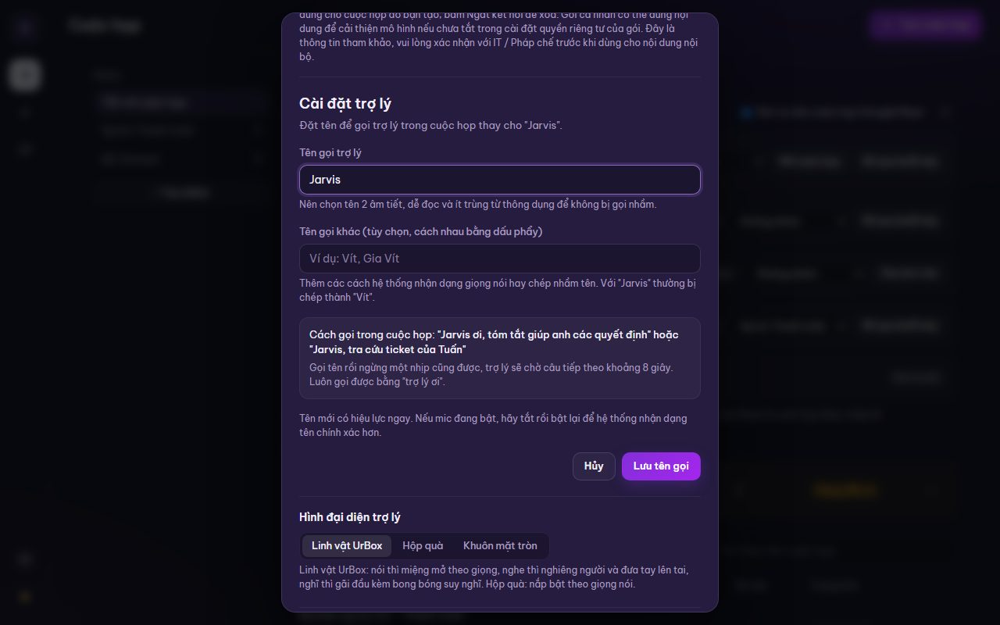

- **Tên gọi trợ lý**:
  - Nên chọn tên 2 âm tiết, dễ đọc, ít trùng từ thông dụng.
  - Thêm "Tên gọi khác" là những cách hệ thống hay chép nhầm. Ví dụ "Jarvis" hay bị chép thành "Vít".
  - Luôn gọi được bằng "trợ lý ơi".
- **Giọng đọc**:
  - **Soniox**: giọng người Việt tự nhiên, đọc đúng từ tiếng Anh. Câu trợ lý nói được gửi tới Soniox để đọc.
  - **Trên máy (Piper)**: miễn phí, không cần mạng, không gửi nội dung ra ngoài, nhưng đọc tiếng Anh theo
    phiên âm.
  - Nội dung nhạy cảm nên chọn Piper.

### 13.3. Lưu trữ, thư mục tài liệu, quản trị

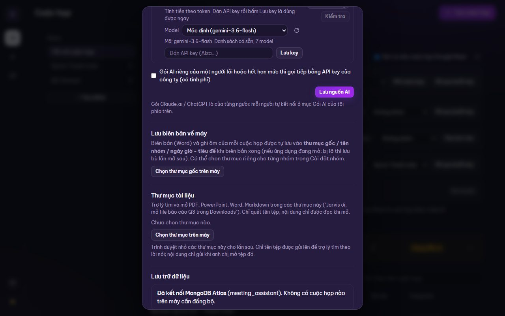

- **Thư mục tài liệu** (bản web):
  - Bấm **Chọn thư mục trên máy**, rồi **Cho phép** khi trình duyệt hỏi.
  - Ứng dụng chỉ đọc tên tệp. Nội dung một tệp chỉ được gửi lên khi bạn mở tệp đó để trình bày.
- **Lưu trữ dữ liệu**:
  - Dữ liệu lưu trên MongoDB Atlas.
  - Mất kết nối Atlas thì cuộc họp được lưu tạm trên máy chủ. Quản trị viên bấm **Đồng bộ lên Atlas** khi kết
    nối lại.

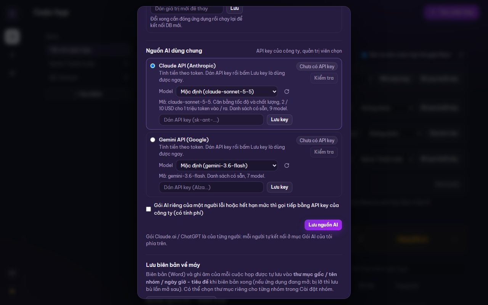

## 14. Quyền riêng tư và dữ liệu

- **Ghi âm và mẫu giọng**:
  - Giọng nói là dữ liệu sinh trắc học theo Nghị định 13/2023/NĐ-CP.
  - Chỉ bật ghi âm khi **mọi người** trong phòng đồng ý. Chỉ lưu mẫu giọng của người đã đồng ý.
  - Ứng dụng ghi lại người xác nhận và thời điểm.
- **Thời hạn lưu**:
  - Ghi âm trên server tự xóa sau số ngày quy định (mặc định 30).
  - Ghi âm trên Drive tự xóa theo số ngày cài trong nhóm.
  - Biên bản được giữ.
- **Bot Google Meet**:
  - Bot báo trong khung chat là cuộc họp được chép lời. Với khách ngoài công ty, nên báo trước.
  - Recall (dịch vụ chạy bot) chỉ giữ bản ghi 1 giờ và xóa ngay khi bot xong.
- **Dữ liệu gửi ra ngoài**:
  - Tra cứu trên mạng chỉ gửi từ khóa đi tìm kiếm.
  - Giọng đọc Soniox gửi câu trợ lý nói tới Soniox.
- **Tài liệu**:
  - Tài liệu mở để trình bày được server đọc xong là xóa.
  - Tài liệu của nhóm BD chỉ lưu phần chữ.
- **Phạm vi xem**: mỗi người chỉ xem được cuộc họp của mình và của nhóm mình. Hồ sơ giọng nói dùng chung cả
  công ty.
- **Gói AI cá nhân**: có thể dùng nội dung để cải thiện mô hình nếu chưa tắt trong cài đặt quyền riêng tư của
  gói. Nội dung nội bộ nên đi qua gói doanh nghiệp hoặc API key của công ty.

## 15. Xử lý sự cố thường gặp

| Hiện tượng | Cách xử lý |
|---|---|
| "Chỉ tài khoản @urbox.vn được dùng ứng dụng này" | Đăng nhập lại bằng tài khoản Google công ty |
| "Phiên đăng nhập đã hết hạn" | Đăng nhập lại (phiên kéo dài 12 giờ) |
| "Không kết nối được máy chủ" | Kiểm tra mạng; vẫn lỗi thì báo quản trị viên |
| "Trình duyệt chưa cho phép dùng micro" | Bấm biểu tượng ổ khóa trên thanh địa chỉ, cho phép micro, bật mic lại |
| "Không tìm thấy micro nào" | Cắm micro hoặc tai nghe rồi thử lại |
| "Một thiết bị khác vừa bật mic cho cuộc họp này" | Mỗi cuộc họp một nguồn mic: tắt mic ở thiết bị kia |
| Trợ lý không phản hồi khi gọi tên | Gọi tên kèm yêu cầu trong cùng câu; thêm "Tên gọi khác" trong Cài đặt nếu tên bị chép sai |
| Gán nhầm người nói | Bấm tên ở đầu đoạn, chọn "Câu này là của..." hoặc gộp người nói; lưu mẫu giọng để lần sau tự nhận ra |
| "Chưa lưu Drive: cần kết nối" | Cài đặt, mục Google (Drive và Lịch): kết nối bằng đúng tài khoản trùng email đăng nhập |
| "Bot không vào được" | Xem lý do ở Lịch sắp tới: chưa ai cho vào, hoặc cuộc họp chỉ cho người trong tổ chức; bấm "Mời bot vào lại" |
| "Chỉ quản trị viên được đổi cài đặt chung" | Nhờ quản trị viên đổi |
| Không thấy cuộc họp người khác gửi link | Người đó cần thêm bạn vào nhóm của cuộc họp |
| Không lưu được biên bản về máy | Dùng Chrome hoặc Edge; bấm "Cho phép lưu" khi trang chủ hỏi |

## 16. Giới hạn cần biết

- **Mic**: mỗi cuộc họp một nguồn mic. Một trình duyệt chỉ ghi một cuộc họp tại một thời điểm.
- **Trình duyệt**: lưu về thư mục và nhớ thư mục tài liệu chỉ có trên Chrome và Edge. Trên Firefox, Safari
  phải chọn lại thư mục mỗi lần mở trang.
- **Âm thanh**: trình duyệt chặn phát âm thanh cho tới khi bạn bấm hoặc gõ phím lần đầu trên trang.
- **Tài liệu mở để trình bày**:
  - tối đa 50 MB mỗi tệp;
  - nhận `.pdf .pptx .ppt .docx .md .txt .json`;
  - PowerPoint nên kèm bản PDF để hiện đúng thiết kế.
- **Tài liệu nhóm BD**: tối đa 25 MB mỗi tệp, 100 tài liệu. PDF dạng ảnh chụp không đọc được chữ.
- **Tìm kiếm của chế độ BD** dựa theo từ khóa (bỏ dấu khi so), không hiểu từ đồng nghĩa. Tài liệu nên dùng
  đúng từ mà khách hay nói.
- **Tra cứu trên mạng**: Jarvis tra khi được yêu cầu; bảng BD chỉ tra khi bấm "Tra thêm trên mạng"; khung hỏi
  của chủ nhóm không tra. Bản web tra bằng công cụ tìm kiếm của Claude (API key của công ty, có tính phí):
  Jarvis khoảng 25-40 giây, bảng BD khoảng 15-30 giây.
- **Gói AI của tôi**: mỗi lần đăng nhập tối đa 6 phút. Bản web chưa hỗ trợ gói Gemini.
- **Google Meet**: bot nghe tối đa 16 người nói cùng lúc, không vào được phòng nhóm nhỏ (breakout room).
