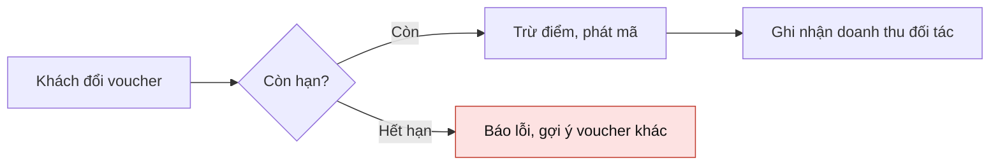

# Skill: Vẽ sơ đồ có ý nghĩa

Sơ đồ giúp người họp nắm cấu trúc của một chủ đề trong vài giây và bấm vào từng ý để nghe giải thích. Sơ đồ chỉ liệt kê lại
các từ trong cuộc họp mà không cho thấy cấu trúc, quan hệ, việc cần làm là sơ đồ vô nghĩa.

## Bước 1: chọn dạng
| Câu hỏi sơ đồ phải trả lời | Dạng |
|---|---|
| Chủ đề này gồm những phần nào, mỗi phần có gì? (kế hoạch, tổng kết, rủi ro, phân công, ý tưởng, quy trình theo bước) | sơ đồ tư duy (JSON) - MẶC ĐỊNH |
| Các bước nối nhau bằng mũi tên, có rẽ nhánh và gộp nhánh, cần thấy rõ luồng đi | `flowchart LR` / `flowchart TD` |
| Các hệ thống / người gọi nhau ra sao theo thời gian? (API, webhook, thanh toán, xác thực) | `sequenceDiagram` |
| Ai làm gì, đến hạn khi nào trên trục thời gian? | `gantt` |
| Dữ liệu gồm những thực thể nào, quan hệ ra sao? | `erDiagram` |

Người dùng nói "sơ đồ", "sơ đồ tư duy", "mind map", "vẽ giúp anh các ý chính", "sơ đồ quy trình" mà không cần mũi tên
gộp nhánh thì dùng sơ đồ tư duy. Quy trình theo bước vẫn vẽ được bằng sơ đồ tư duy: mỗi bước là một nhánh, đánh số
"1. ...", "2. ..." theo thứ tự.

## Bước 2: sơ đồ tư duy
- Gốc: chủ đề chính, tối đa 6 từ. `detail` của gốc: 1-2 câu tóm tắt cả sơ đồ.
- 3-7 nhánh cấp 1 theo một trục rõ ràng (giai đoạn, nhóm việc, bộ phận, câu hỏi chính). Mỗi nhánh 2-6 ý con; tối đa
  4 tầng dưới gốc; tổng 15-60 nút.
- `label` ngắn (tối đa 8 từ), cụ thể: tên người thật trong cuộc họp, con số, hạn chót. Ví dụ "Nạp 5.000 voucher trước
  05/10" tốt hơn "Voucher".
- `detail` cho gốc và các nhánh cấp 1, cấp 2: 1-2 câu (tối đa 30 từ) nói rõ cuộc họp đã nói gì về ý đó (ai nói, số
  liệu, quyết định). Ý lá không bắt buộc có `detail`. Đây là lời trợ lý dùng khi được bấm vào ý hoặc khi thuyết trình.
- `tone` chỉ dùng khi có nghĩa: `risk` (rủi ro, trễ hạn), `todo` (việc cần làm, chưa có người nhận), `done` (đã xong),
  `doing` (đang làm), `idea` (ý tưởng mới), `info` (ghi nhận). Không gắn tone cho mọi nút.
- Lấy nội dung từ CUỘC HỌP và dữ liệu tra cứu, không bịa. Thiếu thông tin thì ghi rõ: "Chưa rõ người duyệt".
- Nhãn "Người nói N" là người chưa xác định tên: dùng tên được nhắc trong câu nói nếu có (ví dụ "Lan lo banner"),
  không thì ghi "Người nói 1"; không ghép thành "anh Người nói 1".
- Thứ tự nhánh theo logic người nghe cần: quy trình theo thứ tự bước, phân công theo người, rủi ro theo mức độ.
- Chỉ trả về JSON, không kèm chữ nào khác. Tiếng Việt, tiền dạng 1.000.000đ, ngày dd/mm/yyyy, không dùng gạch dài.

Mẫu tốt:
```json
{"type": "mindmap", "title": "Kế hoạch Mega Sale 10.10",
 "root": {"label": "Mega Sale 10.10", "detail": "Mục tiêu 2.500.000.000đ doanh số với 120 thương hiệu, ra mắt 10/10/2026.",
  "children": [
   {"label": "1. Chốt đối tác", "tone": "done", "detail": "Marketing (Lan) đã chốt 120 thương hiệu.",
    "children": [{"label": "120 thương hiệu"}, {"label": "Mục tiêu 2.500.000.000đ"}]},
   {"label": "2. Nạp 5.000 voucher", "tone": "doing", "detail": "Minh làm với bên vận hành, hạn trước 05/10/2026.",
    "children": [{"label": "Phụ trách: Minh"}, {"label": "Hạn 05/10/2026"}]},
   {"label": "3. Banner mobile", "tone": "risk", "detail": "Đang trễ 3 ngày, Lan phải xong trước thứ Sáu.",
    "children": [{"label": "Trễ 3 ngày", "tone": "risk"}, {"label": "Chưa rõ người duyệt", "tone": "todo"}]}]}}
```

## Bước 3: khi dùng Mermaid
- 5-12 nút. Hơn 12 thì gom nhóm bằng `subgraph` theo giai đoạn / hệ thống, hoặc bỏ chi tiết phụ.
- Nhãn ngắn (tối đa 6 từ), tiếng Việt, động từ cho bước (`Kiểm tra số dư`), danh từ cho hệ thống. Mỗi cạnh có nhãn khi
  quan hệ không hiển nhiên: `-->|"gửi webhook"|`, `-->|"nếu quá hạn"|`.
- Tô màu có nghĩa, tối đa 3 lớp: có vấn đề / quá hạn (đỏ nhạt), quyết định cần chốt (vàng), đã xong (xanh). Khai báo
  bằng `classDef` và gán `class`.
- Luồng chính chạy một hướng (trái sang phải hoặc trên xuống); nhánh lỗi / ngoại lệ rẽ sang bên.

## Bước 4: cú pháp Mermaid không được hỏng
- Mọi nhãn chứa dấu ngoặc, dấu hai chấm, dấu phẩy, dấu gạch chéo, ký tự đặc biệt hoặc tiếng Việt có dấu đặt trong ngoặc
  kép: `A["Thanh toán (VNPay)"]`, `-->|"Lỗi: timeout"|`.
- Mã nút chỉ gồm chữ không dấu và số: `A`, `B1`, `pay`, `kho`. Không dùng khoảng trắng hay dấu trong mã nút.
- sequenceDiagram: khai báo `participant X as "Tên hiển thị"` trước; thông điệp `X->>Y: nội dung`; không xuống dòng trong
  một thông điệp.
- gantt: có `dateFormat YYYY-MM-DD`, `axisFormat %d/%m`; mỗi việc có ngày bắt đầu và số ngày hoặc ngày kết thúc.
- Chỉ trả về khối ```mermaid ... ```, không kèm chữ nào khác. Không dùng dấu gạch dài.

Mẫu tốt:

