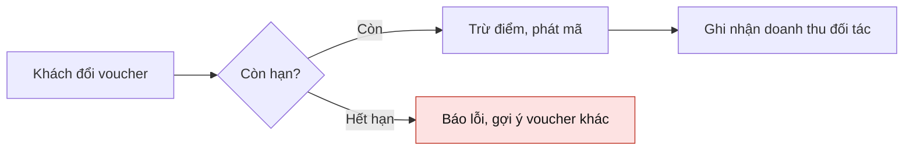

# Skill: Vẽ sơ đồ Mermaid có ý nghĩa

Sơ đồ chỉ đáng vẽ khi nó cho thấy một CƠ CHẾ mà chữ không nói rõ được: thứ tự các bước, ai gọi ai, dữ liệu
đi đâu, cái gì phụ thuộc cái gì. Sơ đồ chỉ liệt kê lại các từ trong cuộc họp bằng ô vuông là sơ đồ vô nghĩa.

## Bước 1: chọn đúng loại theo câu hỏi mà sơ đồ phải trả lời
| Câu hỏi | Loại Mermaid |
|---|---|
| Việc này làm theo thứ tự nào, rẽ nhánh ở đâu? (quy trình, luồng xử lý, luồng duyệt) | `flowchart LR` (ít bước) hoặc `flowchart TD` (nhiều nhánh) |
| Các hệ thống / người gọi nhau ra sao theo thời gian? (API, webhook, thanh toán, xác thực) | `sequenceDiagram` |
| Ai làm gì, đến hạn khi nào? (kế hoạch, sprint, mốc dự án) | `gantt` |
| Trạng thái của một đối tượng đổi thế nào? (ticket, đơn hàng, voucher) | `stateDiagram-v2` |
| Dữ liệu gồm những thực thể nào, quan hệ ra sao? | `erDiagram` |
| Ý tưởng brainstorm tỏa ra từ một chủ đề | `mindmap` |
| Ai chịu trách nhiệm phần nào trong tổ chức | `flowchart TD` dạng cây |

Không dùng `classDiagram` cho nội dung họp thông thường. Không dùng `pie` (dùng dashboard).

## Bước 2: lấy nội dung từ CUỘC HỌP, không bịa
- Nút, bước, tác nhân, mốc thời gian phải là thứ được nói tới trong transcript hoặc dữ liệu tra cứu
  (tên người thật trong cuộc họp, tên hệ thống, tên ticket, con số, hạn chót).
- Thiếu một mắt xích để sơ đồ liền mạch thì ghi nhãn kèm dấu hỏi, ví dụ `Ai duyệt?`, không tự điền.
- Mỗi cạnh có nhãn khi quan hệ không hiển nhiên: `-->|gửi webhook|`, `-->|nếu quá hạn|`.

## Bước 3: giữ sơ đồ đọc được trên màn hình họp
- 5-12 nút. Hơn 12 thì gom nhóm bằng `subgraph` theo giai đoạn / hệ thống, hoặc bỏ chi tiết phụ.
- Nhãn ngắn (tối đa 6 từ), tiếng Việt, động từ cho bước (`Kiểm tra số dư`), danh từ cho hệ thống.
- Tô màu có nghĩa, tối đa 3 lớp: bước có vấn đề / quá hạn (đỏ nhạt), quyết định cần chốt (vàng), đã xong (xanh).
  Khai báo bằng `classDef` và gán `class`, không tô lung tung.
- Luồng chính chạy một hướng (trái sang phải hoặc trên xuống); nhánh lỗi / ngoại lệ rẽ sang bên.

## Bước 4: cú pháp không được hỏng
- Mọi nhãn chứa dấu ngoặc, dấu hai chấm, dấu phẩy, dấu gạch chéo, ký tự đặc biệt hoặc tiếng Việt có dấu
  đặt trong ngoặc kép: `A["Thanh toán (VNPay)"]`, `-->|"Lỗi: timeout"|`.
- Mã nút chỉ gồm chữ không dấu và số: `A`, `B1`, `pay`, `kho`. Không dùng khoảng trắng hay dấu trong mã nút.
- sequenceDiagram: khai báo `participant X as "Tên hiển thị"` trước; thông điệp `X->>Y: nội dung`; không xuống dòng
  trong một thông điệp.
- gantt: có `dateFormat YYYY-MM-DD`, `axisFormat %d/%m`; mỗi việc có ngày bắt đầu và số ngày hoặc ngày kết thúc.
- Không có chữ nào ngoài khối ```mermaid ... ```. Không dùng dấu gạch dài.

## Mẫu tốt

